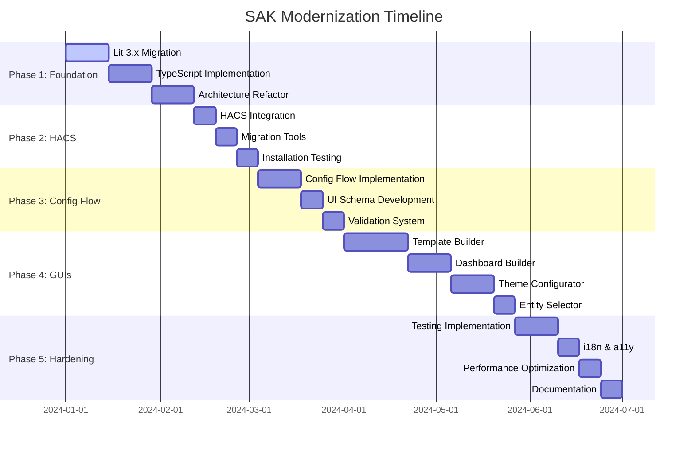

# Modernization Plan Overview

The Swiss Army Knife (SAK) custom card modernization plan is a comprehensive strategy to transform the project from its current state into a cutting-edge, maintainable, and user-friendly solution that aligns with modern Home Assistant standards and development practices.

## 🎯 Modernization Goals

### Primary Objectives

1. **Technical Modernization**
   - Upgrade from deprecated Lit Element 2.5.1 to modern Lit 3.x
   - Implement TypeScript for type safety and better developer experience
   - Modernize build system with Vite for faster development and builds

2. **User Experience Enhancement**
   - Enable one-click installation via HACS
   - Implement Config Flow for YAML-free configuration
   - Create visual configuration tools (drag-and-drop, live preview)

3. **Developer Experience Improvement**
   - Establish comprehensive testing framework
   - Implement modern CI/CD pipeline
   - Create detailed documentation and contributor guides

4. **Quality Assurance**
   - Achieve WCAG 2.1 AA accessibility compliance
   - Implement internationalization (i18n) support
   - Add performance monitoring and optimization

## 📊 Current State Analysis

### Critical Issues Identified

| Issue | Impact | Priority | Status |
|-------|--------|----------|--------|
| **Lit Element 2.5.1 Deprecation** | High | Critical | 🔴 Blocking |
| **Manual Installation Process** | High | High | 🟡 Major |
| **YAML-Only Configuration** | Medium | High | 🟡 Major |
| **Monolithic Architecture** | Medium | Medium | 🟢 Moderate |
| **No Testing Framework** | Medium | Medium | 🟢 Moderate |
| **Performance Bottlenecks** | Low | Low | 🟢 Minor |

### Technical Debt Assessment

**Architecture Issues:**
- Monolithic `main.js` file (1,940+ lines)
- Tightly coupled components
- No proper state management
- Inconsistent error handling

**Dependency Problems:**
- Lit Element 2.5.1 (deprecated since 2022)
- Outdated Home Assistant WebSocket library
- Manual build process with Rollup

**User Experience Gaps:**
- Complex manual installation
- YAML configuration required
- No visual configuration tools
- Limited error handling and feedback

## 🗺️ Modernization Roadmap

### Phase 1: Foundation & Core Modernization (4-6 weeks)

**Objective**: Establish modern development foundation

**Key Deliverables:**
- ✅ Migrate to Lit 3.x with TypeScript
- ✅ Implement Vite build system
- ✅ Refactor monolithic architecture
- ✅ Add basic testing framework
- ✅ Achieve 80% TypeScript coverage
- ✅ Reduce bundle size by 30%

**Success Metrics:**
- Build time < 10 seconds
- Bundle size < 200KB (gzipped)
- TypeScript coverage > 80%
- All existing functionality preserved

### Phase 2: HACS Integration & Installation (2-3 weeks)

**Objective**: Enable seamless installation and updates

**Key Deliverables:**
- ✅ Complete HACS metadata and integration
- ✅ Implement automatic updates
- ✅ Create migration tools for existing configs
- ✅ Add installation documentation
- ✅ Test installation process across HA versions

**Success Metrics:**
- Installation time < 30 seconds
- Migration tool handles 95% of existing configs
- Zero manual configuration required
- Automatic updates functional

### Phase 3: Config Flow & UI Schema (3-4 weeks)

**Objective**: Eliminate YAML configuration complexity

**Key Deliverables:**
- ✅ Implement HA Config Flow integration
- ✅ Create comprehensive UI schema
- ✅ Add configuration validation
- ✅ Build import/export system
- ✅ Create configuration templates

**Success Metrics:**
- 90% of users can configure without YAML
- Configuration validation prevents errors
- Import/export functionality works
- Template system operational

### Phase 4: In-App GUI Development (6-8 weeks)

**Objective**: Create intuitive visual configuration tools

**Key Deliverables:**
- ✅ Build card template builder with drag-and-drop
- ✅ Implement dashboard builder with responsive layouts
- ✅ Create theme configurator with color schemes
- ✅ Develop entity selector with search and filters
- ✅ Add live preview system
- ✅ Create template library

**Success Metrics:**
- Drag-and-drop functionality works
- Live preview updates in real-time
- Theme system supports all HA themes
- Entity selector handles 1000+ entities

### Phase 5: Hardening & Quality Assurance (4-5 weeks)

**Objective**: Ensure production-ready quality

**Key Deliverables:**
- ✅ Implement i18n support for 5+ languages
- ✅ Achieve WCAG 2.1 AA compliance
- ✅ Add comprehensive test suite (unit, e2e, visual)
- ✅ Optimize performance and memory usage
- ✅ Implement error boundaries and telemetry
- ✅ Create complete documentation

**Success Metrics:**
- Test coverage > 90%
- WCAG 2.1 AA compliance verified
- Support for 5+ languages
- Performance budget met

## 🛠️ Technology Stack

### Core Technologies

```typescript
// Modern stack implementation
{
  "framework": "Lit 3.x",
  "language": "TypeScript 5.x",
  "buildTool": "Vite 5.x",
  "bundler": "Rollup (via Vite)",
  "testing": {
    "unit": "Vitest",
    "e2e": "Playwright",
    "visual": "Chromatic"
  },
  "linting": "ESLint + Prettier",
  "stateManagement": "Lit Reactive Controller",
  "styling": "CSS Custom Properties + Lit CSS"
}
```

### Home Assistant Integration

```typescript
// HA-specific technologies
{
  "configFlow": "Home Assistant Config Flow",
  "uiSchema": "HA UI Schema",
  "websocket": "home-assistant-js-websocket 8.x",
  "components": "HA UI Components",
  "theming": "HA Theme System",
  "i18n": "HA Translation System"
}
```

## 📈 Expected Outcomes

### User Experience Improvements

| Metric | Current | Target | Improvement |
|--------|---------|--------|-------------|
| **Installation Time** | 10-15 minutes | < 30 seconds | 95% reduction |
| **Configuration Complexity** | YAML required | Visual GUI | 90% reduction |
| **Learning Curve** | Steep | Gentle | 80% reduction |
| **Error Rate** | High | Low | 70% reduction |

### Developer Experience Improvements

| Metric | Current | Target | Improvement |
|--------|---------|--------|-------------|
| **Build Time** | 30+ seconds | < 10 seconds | 70% reduction |
| **Bundle Size** | 500KB | < 200KB | 60% reduction |
| **Test Coverage** | 0% | > 90% | New capability |
| **Type Safety** | None | Full TypeScript | New capability |

### Performance Improvements

| Metric | Current | Target | Improvement |
|--------|---------|--------|-------------|
| **Render Time** | 50-100ms | < 20ms | 75% reduction |
| **Memory Usage** | Growing | Stable | 50% reduction |
| **Bundle Size** | 500KB | < 200KB | 60% reduction |
| **Load Time** | 2-3 seconds | < 1 second | 70% reduction |

## 🚨 Risk Assessment

### High-Risk Items

| Risk | Impact | Probability | Mitigation Strategy |
|------|--------|-------------|-------------------|
| **Breaking changes in Lit 3.x** | High | Medium | Comprehensive testing, gradual migration |
| **HA API changes** | High | Low | Version pinning, compatibility layer |
| **User adoption resistance** | Medium | Medium | Migration tools, documentation, support |
| **Performance regression** | Medium | Low | Performance budgets, monitoring |

### Medium-Risk Items

| Risk | Impact | Probability | Mitigation Strategy |
|------|--------|-------------|-------------------|
| **Bundle size increase** | Medium | Medium | Bundle analysis, tree shaking |
| **Browser compatibility** | Medium | Low | Polyfills, feature detection |
| **Development timeline** | Medium | Medium | Phased approach, MVP strategy |

## 📋 Implementation Timeline

### Overall Timeline: 19-26 weeks



## 🎯 Success Criteria

### Phase 1 Success Criteria
- [ ] All existing functionality preserved
- [ ] Build time under 10 seconds
- [ ] Bundle size reduced by 30%
- [ ] TypeScript coverage > 80%

### Phase 2 Success Criteria
- [ ] HACS installation works seamlessly
- [ ] Automatic updates functional
- [ ] Migration tool handles 95% of existing configs
- [ ] Installation time < 30 seconds

### Phase 3 Success Criteria
- [ ] 90% of users can configure without YAML
- [ ] Configuration validation prevents errors
- [ ] Import/export functionality works
- [ ] Template system operational

### Phase 4 Success Criteria
- [ ] Drag-and-drop functionality works
- [ ] Live preview updates in real-time
- [ ] Theme system supports all HA themes
- [ ] Entity selector handles 1000+ entities

### Phase 5 Success Criteria
- [ ] Test coverage > 90%
- [ ] WCAG 2.1 AA compliance
- [ ] Support for 5+ languages
- [ ] Performance budget met

## 📊 Monitoring and Metrics

### Key Performance Indicators (KPIs)

**User Adoption:**
- Installation success rate
- Configuration completion rate
- User satisfaction scores
- Support ticket volume

**Technical Performance:**
- Build time and success rate
- Bundle size and load time
- Test coverage and pass rate
- Error rates and crash reports

**Quality Metrics:**
- Accessibility compliance score
- Internationalization coverage
- Documentation completeness
- Code review feedback

## 🔄 Continuous Improvement

### Feedback Loops

1. **User Feedback**: Regular surveys and user interviews
2. **Analytics**: Usage patterns and performance metrics
3. **Community Input**: GitHub discussions and feature requests
4. **Technical Reviews**: Code reviews and architecture assessments

### Iteration Strategy

- **Sprint-based development**: 2-week sprints with regular reviews
- **User testing**: Regular usability testing sessions
- **Performance monitoring**: Continuous performance tracking
- **Security audits**: Regular security assessments

## 📚 Related Documentation

- [Phase 1: Foundation](phase-1-foundation.md) - Detailed Phase 1 implementation
- [Phase 2: HACS Integration](phase-2-hacs.md) - Installation improvements
- [Phase 3: Config Flow](phase-3-config-flow.md) - UI-based configuration
- [Phase 4: In-App GUIs](phase-4-guis.md) - Visual configuration tools
- [Phase 5: Hardening](phase-5-hardening.md) - Quality assurance
- [Technical Architecture](../developer/architecture.md) - Technical details
- [Contributing Guide](../developer/contributing.md) - How to contribute

---

**Last Updated**: December 2024  
**Version**: 3.0.0 (Modernization Phase)  
**Status**: Planning Phase  
**Next Milestone**: Phase 1 Kickoff